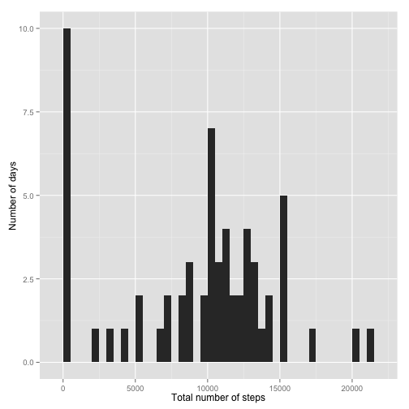
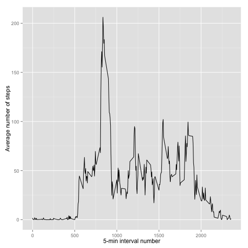
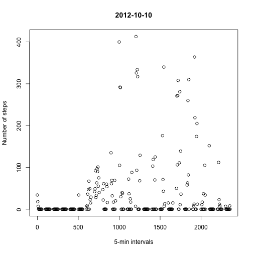
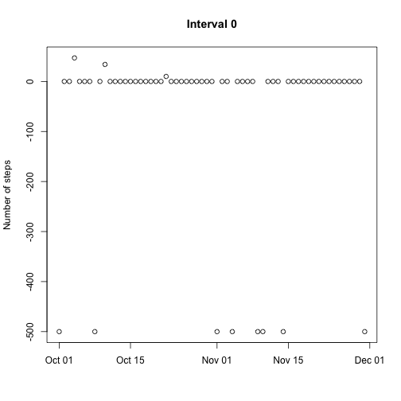
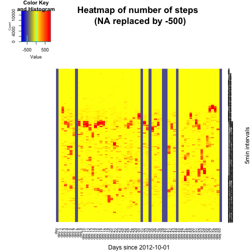
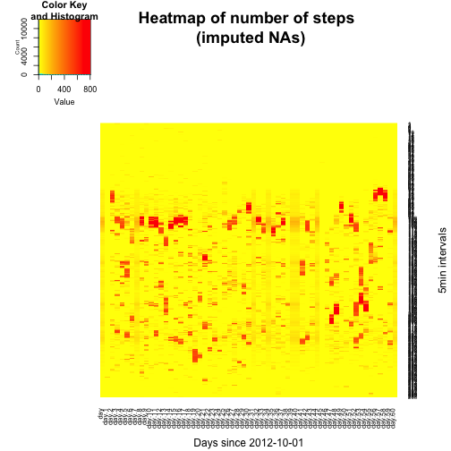
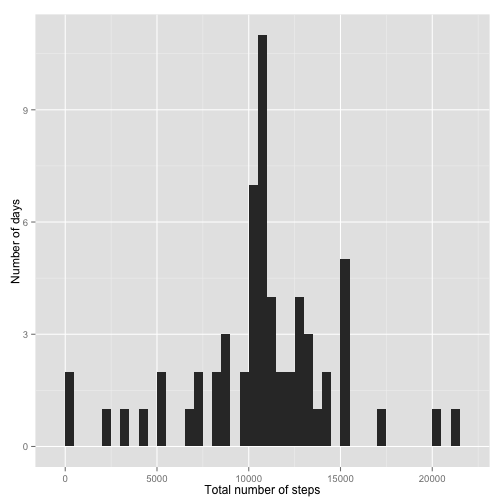
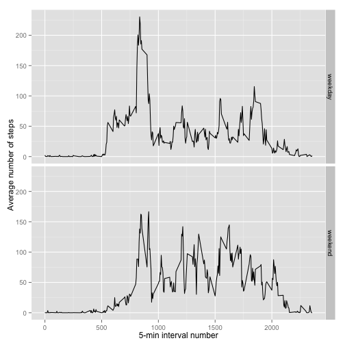

Reproducible Research: Peer Assessment 1
==========================================

## Loading and preprocessing the data
As indicated in the README.md file, the goal of this assignment is to answer questions on walking patterns observed in data collected through a personal activity monitoring device.

To do so, I proceeded as follows:

#### 1. Load the appropriate libraries:

```r
library(dplyr)
library(ggplot2)
library(lubridate)
```

#### 2. Unzip and read the file

```r
file <- unzip("activity.zip")
data <- read.csv(file)
```

#### 3. Check the file content

```r
str(data)
```

```
## 'data.frame':	17568 obs. of  3 variables:
##  $ steps   : int  NA NA NA NA NA NA NA NA NA NA ...
##  $ date    : Factor w/ 61 levels "2012-10-01","2012-10-02",..: 1 1 1 1 1 1 1 1 1 1 ...
##  $ interval: int  0 5 10 15 20 25 30 35 40 45 ...
```

The current structure of the 'data' data frame is not standard. It needs some transformations:

#### 4. Re-arrange the columns and store the data in a new data frame: data2

```r
data2 <- data
data2[,1] <- data[,2]
data2[,2] <- data[,3]
data2[,3] <- data[,1]
names(data2) <- c("date","interval","steps")
```

#### 5. Check that data2's columns are in the right order

```r
str(data2)
```

```
## 'data.frame':	17568 obs. of  3 variables:
##  $ date    : Factor w/ 61 levels "2012-10-01","2012-10-02",..: 1 1 1 1 1 1 1 1 1 1 ...
##  $ interval: int  0 5 10 15 20 25 30 35 40 45 ...
##  $ steps   : int  NA NA NA NA NA NA NA NA NA NA ...
```
 
#### 6. Transform the dates into a date format

```r
data2[,1] <- as.Date(as.character(data2[,1]), "%Y-%m-%d")
```

#### 7. Check that the elements in the "date" column are indeed dates:

```r
months(data2[1,1])
```

```
## [1] "October"
```
which is consistent with "2012-10-01"

## What is the mean total number of steps taken per day?
In this section of the assignment, several questions are asked:

#### 1. What is the total number of steps taken per day?

To answer this question, one can use the sum function on the "steps" column for each unique date, while ignoring missing values:

```r
dailysteps <- tapply(data2$steps, format(data2$date, '%Y-%m-%d'), sum, na.rm=TRUE)
```
which gives:

```r
dailysteps
```

```
## 2012-10-01 2012-10-02 2012-10-03 2012-10-04 2012-10-05 2012-10-06 
##          0        126      11352      12116      13294      15420 
## 2012-10-07 2012-10-08 2012-10-09 2012-10-10 2012-10-11 2012-10-12 
##      11015          0      12811       9900      10304      17382 
## 2012-10-13 2012-10-14 2012-10-15 2012-10-16 2012-10-17 2012-10-18 
##      12426      15098      10139      15084      13452      10056 
## 2012-10-19 2012-10-20 2012-10-21 2012-10-22 2012-10-23 2012-10-24 
##      11829      10395       8821      13460       8918       8355 
## 2012-10-25 2012-10-26 2012-10-27 2012-10-28 2012-10-29 2012-10-30 
##       2492       6778      10119      11458       5018       9819 
## 2012-10-31 2012-11-01 2012-11-02 2012-11-03 2012-11-04 2012-11-05 
##      15414          0      10600      10571          0      10439 
## 2012-11-06 2012-11-07 2012-11-08 2012-11-09 2012-11-10 2012-11-11 
##       8334      12883       3219          0          0      12608 
## 2012-11-12 2012-11-13 2012-11-14 2012-11-15 2012-11-16 2012-11-17 
##      10765       7336          0         41       5441      14339 
## 2012-11-18 2012-11-19 2012-11-20 2012-11-21 2012-11-22 2012-11-23 
##      15110       8841       4472      12787      20427      21194 
## 2012-11-24 2012-11-25 2012-11-26 2012-11-27 2012-11-28 2012-11-29 
##      14478      11834      11162      13646      10183       7047 
## 2012-11-30 
##          0
```
or, in a data frame format:

```r
library(reshape2)
dailysteps_df <- melt(dailysteps)
names(dailysteps_df) <- c("Date","Total_nber_steps")
dailysteps_df[,1] <- as.Date(as.character(dailysteps_df[,1]), "%Y-%m-%d")
```
which gives:

```r
head(dailysteps_df)
```

```
##         Date Total_nber_steps
## 1 2012-10-01                0
## 2 2012-10-02              126
## 3 2012-10-03            11352
## 4 2012-10-04            12116
## 5 2012-10-05            13294
## 6 2012-10-06            15420
```

*Note: The instructions indicate that missing values can be ignored. This is what I did when using na.rm = TRUE in the calculation of dailysteps. However, this replaces NAs by zeros, which is not appropriate, as this reduces the median and mean requested below. On the other hand, keeping all NAs means that the sum of steps taken in days when actual values were obtained for certain intervals and NAs were obtained for others will be an NA, which isn't good either. As the handling of NAs is covered in the "Imputing missing values" section, I decided to go with na.rm = TRUE.*

#### 2. Make a histogram of the total number of steps taken each day

This is easily done from dailysteps_df and the ggplot2 library (already installed):

```r
qplot(Total_nber_steps, data=dailysteps_df, geom="histogram",binwidth=500, 
      xlab="Total number of steps", ylab="Number of days")
```

 

where each bar is 500 units (i.e. steps) wide.

The tall bar at 0 is due not only to actual 0 values, but also to the fact that NAs are replaced by 0 (due to na.rm=TRUE).

#### 3. What are the mean and median of the total number of steps taken per day?

From the results of the 'median' and 'mean' functions on the "Total_nber_steps" columns of dailysteps_df:

```r
median(dailysteps_df[[2]],na.rm=TRUE)
```

```
## [1] 10395
```

```r
mean(dailysteps_df[[2]],na.rm=TRUE)
```

```
## [1] 9354.23
```

the median is 10395 steps and the mean is 9354.23 steps taken per day. *Note: the 'summary' function truncates values.*

## What is the average daily activity pattern?
Here too, several questions are asked:

#### 1. Make a time series plot of the 5-minute interval and the average number of steps taken, averaged across all days

By computing the mean of steps for each value of "interval", one gets the data needed to create this plot:

```r
interval_avg <- tapply(data2$steps, data2$interval, mean, na.rm=TRUE)
```
or, in a data frame format:

```r
intervalavg_df <- melt(interval_avg)
names(intervalavg_df) <- c("Intervals","Average")
```
which gives:

```r
head(intervalavg_df)
```

```
##   Intervals   Average
## 1         0 1.7169811
## 2         5 0.3396226
## 3        10 0.1320755
## 4        15 0.1509434
## 5        20 0.0754717
## 6        25 2.0943396
```

Using this data frame, one gets the plot requested:

```r
ggplot(intervalavg_df, aes(Intervals, Average)) + geom_line() + 
        xlab("5-min interval number") + ylab("Average number of steps")
```

 

#### 2. Which 5-minute interval, on average across all the days in the dataset, contains the maximum number of steps?

The 5-minute interval with the maximum number of steps, on average across all days is:

```r
intervalavg_df$Intervals[which.max(intervalavg_df$Average)]
```

```
## [1] 835
```

```r
max(intervalavg_df$Average)
```

```
## [1] 206.1698
```
The 5-minute interval #835 has the maximum average with 206.17 steps per day.

## Imputing missing values

This section consists of 4 steps:

#### 1. Total number of missing values in the dataset (i.e. the total number of rows with NAs)

As mentioned above, the dataset considered contains many rows with NA. It actually contains:

```r
sum(is.na(data2$steps))
```

```
## [1] 2304
```
2304 of them.

#### 2. Strategy for filling in all of the missing values in the dataset

To be able to devise a strategy for how to impute missing data, it is important to understand where these missing data are. Plotting a simple time series of the data for each day:

```r
nomissingdata <- data2
nomissingdata$steps[is.na(nomissingdata$steps)] <- -500 # Replacing NA by -500
datelist <- unique(nomissingdata$date) # List of unique days in the dataset
for (k in 1:61){
        filenm = paste("plot",k,".png",sep="")
        png(filename = filenm, width = 480, height = 480, units = "px")
        # Extracting the data for the day 'datelist[k]'
        sub<-filter(nomissingdata,date==datelist[k])
        # Plotting these data
        plot(sub$interval,sub$steps, main=datelist[k])
        dev.off()
}
```

an example of which is:

```r
sub<-filter(nomissingdata,date==datelist[10])
plot(sub$interval,sub$steps, main=datelist[10], xlab="5-min intervals", ylab="Number of steps")
```

 

and for each 5-min interval:

```r
intervallist <- unique(nomissingdata$interval) # List of unique intervals in the dataset
for (k in 1:288){
        filenm = paste("plot_interval_",k,".png",sep="")
        png(filename = filenm, width = 480, height = 480, units = "px")
        # Extracting the data for the interval 'intervallist[k]'
        sub<-filter(nomissingdata,interval==intervallist[k])
        # Plotting these data
        plot(sub$date,sub$steps, main=intervallist[k])
        dev.off()
}
```

an example of which is:

```r
sub<-filter(nomissingdata,interval==intervallist[1])
plot(sub$date,sub$steps, main=paste("Interval", intervallist[1]), xlab="", ylab="Number of steps")
```

 

helps see where the missing data points are (here replaced by -500).

Another way to look at the data, in a more compact format, is to create a heatmap:

```r
library(gplots)
master_df <- data.frame(unique(data2$interval))
for (k in 1:61){
        # Extracting the data for the day 'datelist[k]'
        sub<-filter(nomissingdata,date==datelist[k])
        section<-sub[,3] # Extracting only the steps values
        master_df<-cbind(master_df,section)        
}

# Converting to a matrix
master_matrix <- data.matrix(master_df[,2:62])
# Changing the matrix column names
colnames(master_matrix) <- gsub("section","day",colnames(master_matrix))
library(RColorBrewer)
# Defining the heatmap color palette
col_palette <- colorRampPalette(c("blue", "yellow", "red"))(n = 1000)
par(mar=c(0,0,0,0))
# Plotting the heatmap
lwidth = c(2,7)
lheight = c(1.5,4)
master_heatmap <- heatmap.2(master_matrix, dendrogram='none', Rowv=FALSE, 
                            Colv=FALSE,trace='none', col= col_palette, lhei = lheight, 
                            lwid = lwidth, xlab="Days since 2012-10-01", ylab="5min intervals", 
                            main="Heatmap of number of steps \n (NA replaced by -500)")
```

 

After finding the list of unique intervals, one can extract the data one day at a time (sub) and store them in data frame which columns are different days (master_df). After transforming it into a matrix and changing the names of its columns (master_matrix), it is possible to plot all the data as a heatmap. The one shown above displays days as columns and 5-min intervals as rows. Note that to clearly see where the NAs are, I replaced them by -500 (which gives a blue color on the graph). It is very easy to see that the NAs are all concentrated in 8 days (#1, 8, 32, 35, 40, 41, 45 and 61, where day 1 is Oct. 1st, 2012 and day 61 is Nov. 30, 2012). Consequently, missing values cannot be imputed by doing daily averages.  I chose here to do interval averages and used 'interval_avg' computed above.

#### 3. Creation of a new dataset that is equal to the original dataset but with missing data filled in


```r
filledindata <- data2
nadatelist <- unique(data2$date[is.na(data2$steps)]) # Identifying days with missing data
nadatelist <- as.Date(as.character(nadatelist)) # Transforming into 'Date' format
for (kk in 1:length(nadatelist)){
        # Replacing NAs by corresponding interval average
        filledindata$steps[filledindata$date == nadatelist[kk]] <- interval_avg
}
```

The initial dataset was stored into 'filledindata'. For each of the 8 days for which NAs exist (nadatelist), the number of steps for each interval was replaced by the respective 5-min interval average (NA removed).

Proceeding similarly as before, but this time with the filled in dataset, one can get the new heatmap below:


```r
master_df2 <- data.frame(unique(filledindata$interval))
for (k in 1:61){
        sub<-filter(filledindata,date==datelist[k])
        section<-sub[,3] # Extracting only the steps values
        master_df2<-cbind(master_df2,section)        
}

# Converting to a matrix
master_matrix2 <- data.matrix(master_df2[,2:62])
# Changing the matrix column names
colnames(master_matrix2) <- gsub("section","day",colnames(master_matrix2))
# Defining the heatmap color palette
col_palette2 <- colorRampPalette(c("yellow", "red"))(n = 1000)
par(mar=c(0,0,0,0))
# Plotting the heatmap
lwidth = c(2,7)
lheight = c(1.5,4)
master_heatmap2 <- heatmap.2(master_matrix2, dendrogram='none', Rowv=FALSE, 
                             Colv=FALSE,trace='none', col= col_palette2,lhei = lheight, 
                            lwid = lwidth, xlab="Days since 2012-10-01", ylab="5min intervals",
                            main="Heatmap of number of steps \n (imputed NAs)")
```

 

To keep the same colors for comparable values, the color palette is now yellow to red (instead of blue to red). The 8 days for which NAs existed are still slightly distinguishable, but no longer contain NAs. 

#### 4. Histogram of the total number of steps taken each day

The computation of the sum of the number of steps taken each day can be done as follows:

```r
# Summing on the 'steps' column
newdailysteps <- tapply(filledindata$steps, format(filledindata$date, '%Y-%m-%d'), sum)
newdailysteps_df <- melt(newdailysteps) # Storing the results in a data frame
names(newdailysteps_df) <- c("Date","Total_nber_steps") # Renaming the columns
# Transforming the dates into the 'Date' class
newdailysteps_df[,1] <- as.Date(as.character(newdailysteps_df[,1]), "%Y-%m-%d")
```
which gives:

```r
head(newdailysteps_df)
```

```
##         Date Total_nber_steps
## 1 2012-10-01         10766.19
## 2 2012-10-02           126.00
## 3 2012-10-03         11352.00
## 4 2012-10-04         12116.00
## 5 2012-10-05         13294.00
## 6 2012-10-06         15420.00
```

hence the following histogram:

```r
qplot(Total_nber_steps, data=newdailysteps_df, geom="histogram",
      binwidth=500, xlab="Total number of steps", ylab="Number of days")
```

 

The median and mean number of steps taken per day are now:

```r
median(newdailysteps_df[[2]])
```

```
## [1] 10766.19
```

```r
mean(newdailysteps_df[[2]])
```

```
## [1] 10766.19
```
identical and equal to 10766.19 steps.

These values differ from those initially found (respectively 10395 and 9354.23) when removing the NAs from the dataset. Imputing NA values introduces a bias toward the data that already exist in the dataset. As shown on the heatmap, most of the values in this dataset are zeros. As I replaced NAs by values different from zero, in most cases, I added some signal. This then caused the mean and median to be higher than those obtained when I removed the NAs, at the beginning of this assignment.

## Are there differences in activity patterns between weekdays and weekends?

To answer this question, one needs to first identify which days are during the week, and which ones are in weekends.

#### 1. Creation of a new factor variable with two levels – “weekday” and “weekend” – from the filled in dataset

Thanks to the weekdays() function, one can obtain the name of each day, and subsequently determine whether it is a weekday or weekend day.

```r
dayofweek <- weekdays(filledindata$date) # Determining the day names
daytypefac = rep("weekday", 17568) # Creating a 'weekday' only array
# Replacing 'weekday' by 'weekend' for Saturdays and Sundays
daytypefac[dayofweek == "Saturday" | dayofweek == "Sunday"] <- "weekend"
daytypefac <- as.factor(daytypefac) # Transforming into the Factor class
filledindata$daytype <- daytypefac # Assigning to the 'filledindata' data frame
```

After storing the names of the days in 'dayofweek', one can create an array 'daytypefac' containing only "weekday", and replace by 'weekend' only the elements which indices are the same as the "Saturdays" and "Sundays" in 'dayofweek'. 'daytypefac' is then converted to a factor array and is then added to the 'filledindata' data frame.

As an example, this gives:

```r
dayofweek[1430:1450]
```

```
##  [1] "Friday"   "Friday"   "Friday"   "Friday"   "Friday"   "Friday"  
##  [7] "Friday"   "Friday"   "Friday"   "Friday"   "Friday"   "Saturday"
## [13] "Saturday" "Saturday" "Saturday" "Saturday" "Saturday" "Saturday"
## [19] "Saturday" "Saturday" "Saturday"
```

```r
daytypefac[1430:1450]
```

```
##  [1] weekday weekday weekday weekday weekday weekday weekday weekday
##  [9] weekday weekday weekday weekend weekend weekend weekend weekend
## [17] weekend weekend weekend weekend weekend
## Levels: weekday weekend
```

where 'daytypefac' is in good agreement with the content of 'dayofweek'.

From there, it is possible to plot 2 times series of activity patterns during weekdays and weekends.

#### 2. Average number of steps taken every 5-minute interval, averaged across all weekdays or weekend days


```r
ggplot(filledindata, aes(interval, steps)) + facet_grid(daytype ~ .) + 
        xlab("5-min interval number") + ylab("Average number of steps") + 
        stat_summary(fun.y = mean, geom = "line", position="dodge")
```

 

There are indeed differences in patterns between weekdays and weekends. The average number of steps in weekends seems to be most significant from the ~750th 5-min interval. Most of the following intervals show an average between ~ 50 and 150 steps. On the contary, during weekdays, the monitored person starts walking earlier. There is a peak of activity at the 835th 5-min interval (possibly on his/her way to work?). During the rest of the day, the average number of steps is around ~ 25, with 4 distinguishable peaks reaching up to ~ 120 steps.
